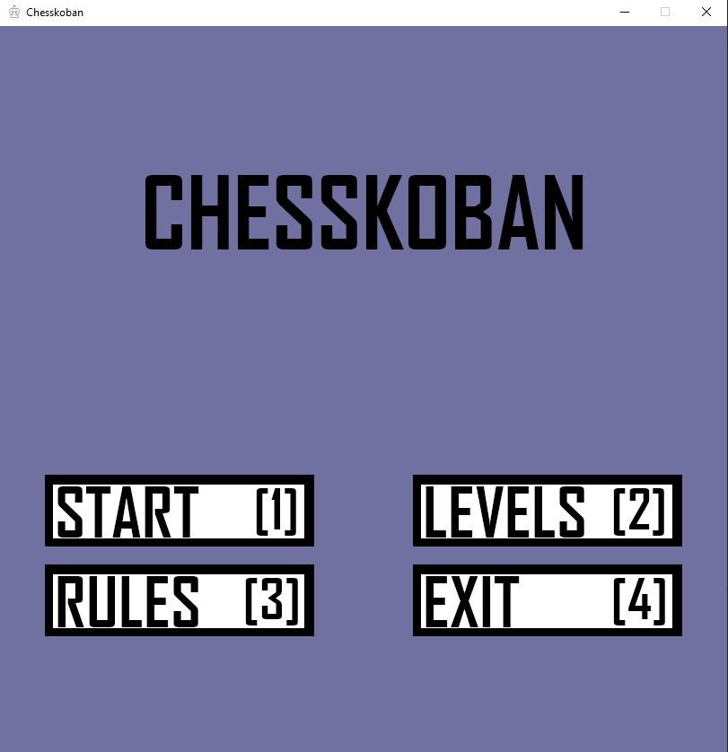
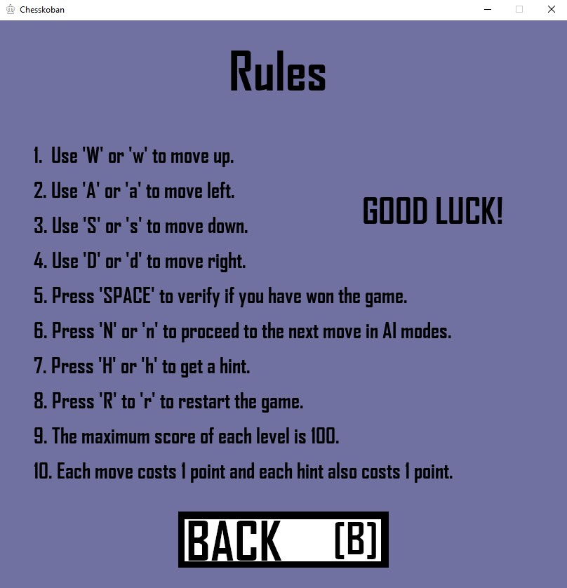
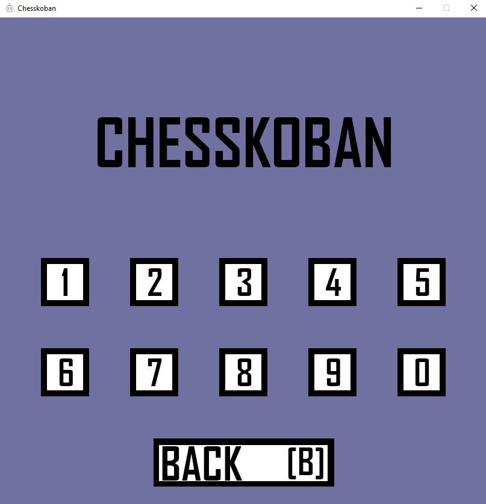
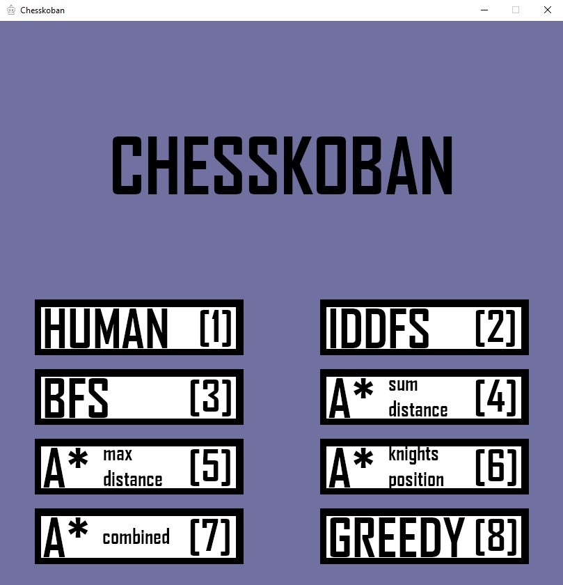

# Chesskoban

## Introduction
Chesskoban is a Puzzle game with the combination of Chess mechanics and Sokoban game for chess lovers and beginners.

## How to play
The board is set up with only **black and white knights** on random positions. There is an additional piece called the **Player**, which is represented by a unique piece, inspired on the **King**.
The goal is to **reposition the white knights, pushing them with the King** in order to capture the black knights. Once all the black knights are captured, the Player wins.

## Pieces
- **King**: moves 1 space at a time, forward/back, sideways and diagonally;
- **White Knight**: moves forward/back and to the side, in an 'L' shape (2 spaces forward/back and 1 to the side, or 1 forward/back and 2 to the side); can jump.

## Rules
- Use "W" or 'w' to move up.
- Use 'A' or 'a' to move left.
- Use 'S' or 's' to move down.
- Use 'D' or 'd' to move right.
- Press 'SPACE' to verify if you have won the game.
- Press 'N' or 'n' to preceed to the next move in AI modes.
- Press 'H' or 'h' to get a hint.
- Press 'R' or 'r' to restart the game.
- The maximum score of each level is 100.
- Each move costs 1 point and each hint also costs 1 point.

## Usage
### Setup
The game was developed using Python 3.12, however it can be played in every version of **python3**. **Pygame** was used to display the game, more specifically `pygame 2.5.2`, so it is necessary to install its package to run the application. In order to achieve this, the following command must be run:
```bash
pip install pygame
```
### Run
To run the application, it is required to change the location to the source (`src`) folder and run the `main.py` file, all inside the IDE.
```bash
cd src
python .\main.py
# or
python3 .\main.py
```

## Menus

| Main menu | Rules menu | Levels menu | Methods menu |
| ---------------- | --------- | ------------------ | -----|
| Here the player can choose if he wants to **Start** the game, choose its **Levels**, go to the **Rules** or **Exit** the game. | The **game rules** are displayed in this menu. | Here the player can choose the **level** to play to, then choose the **method** to use to play it. | In this menu the player can choose how he wants to play the game. It can either be the **human player or a machine player**. |
|  |  |  |  |

## References
- https://store.steampowered.com/app/1784220/Chesskoban__Chess_Puzzles/
- https://www.sokobanonline.com/help/how-to-play
- https://chess.com/learn-how-to-play-chess

## Group elements
- Daniel Dória, up202108808@up.pt
- Leonor Filipe, up202204354@up.pt
- Luís Alves, up202108727@up.pt
